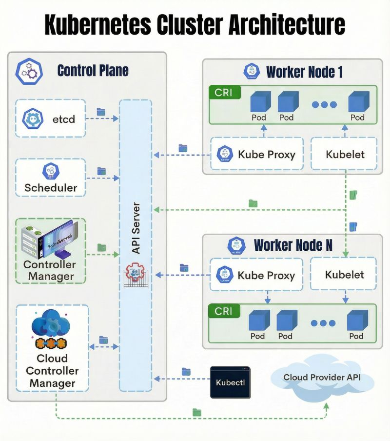
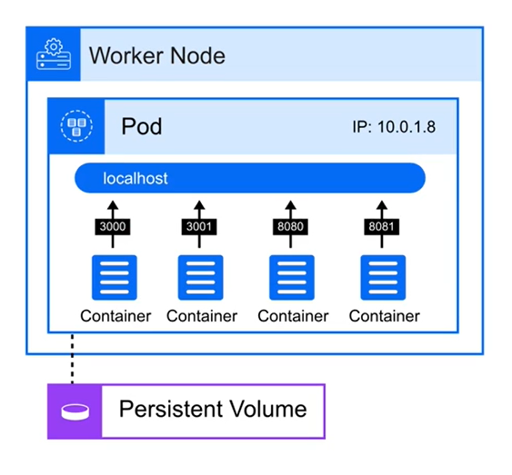
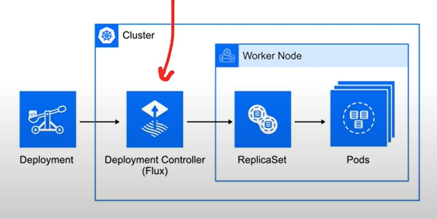
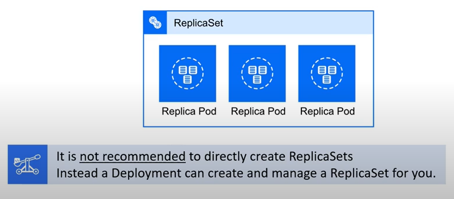

## Table of Contents
- [What is Cloud Native ?](#what-is-cloud-native-)
  - [Cloud Native Computing Foundation (CNCF)](#cloud-native-computing-foundation-cncf)
- [Kubernetes (K8s)](#kubernetes-k8s)
  - [What is Kubernetes?](#what-is-kubernetes)
  - [Key Advantage Over Docker](#key-advantage-over-docker)
  - [Pods - The Unique Component](#pods---the-unique-component)
- [Kubernetes Components Overview](#kubernetes-components-overview)
  - [Core Organizational Structure](#core-organizational-structure)
  - [Application Components](#application-components)
  - [Control Plane Components (The Brain)](#control-plane-components-the-brain)
  - [Node Components (The Workers)](#node-components-the-workers)
  - [Configuration \& Data Management](#configuration--data-management)
  - [Workload Management](#workload-management)
  - [Security \& Networking](#security--networking)
- [Manifest Files in Kubernetes](#manifest-files-in-kubernetes)
  - [What "Manifest" Means](#what-manifest-means)
  - [Types of Manifest Files](#types-of-manifest-files)
  - [File Formats](#file-formats)
  - [Multiple Components in One File](#multiple-components-in-one-file)
  - [How to Use Manifest Files](#how-to-use-manifest-files)
- [Kubernetes Architecture: Control Plane vs Worker Nodes](#kubernetes-architecture-control-plane-vs-worker-nodes)
  - [Control Plane (Master Node)](#control-plane-master-node)
    - [Key Components:](#key-components)
  - [Worker Nodes](#worker-nodes)
    - [Key Components:](#key-components-1)
  - [How They Work Together](#how-they-work-together)
- [Pods](#pods)
    - [Key Commands:](#key-commands)
- [API Server](#api-server)
  - [Key Points](#key-points)
- [Deployment](#deployment)
  - [How It Works](#how-it-works)
    - [The Chain:](#the-chain)
  - [Key Concepts](#key-concepts)
    - [Declarative Updates](#declarative-updates)
    - [Deployment Controller](#deployment-controller)
  - [What Deployment Manages](#what-deployment-manages)
- [ReplicaSet](#replicaset)
  - [Key Concepts](#key-concepts-1)
    - [Ownership Link](#ownership-link)
    - [Autoscaling](#autoscaling)
- [Stateless vs Stateful](#stateless-vs-stateful)
  - [Stateless Applications (ReplicaSets/Deployments)](#stateless-applications-replicasetsdeployments)
    - [Characteristics:](#characteristics)
    - [Load Balancing:](#load-balancing)
  - [Stateful Applications (StatefulSets)](#stateful-applications-statefulsets)
    - [Characteristics:](#characteristics-1)
    - [Routing Considerations:](#routing-considerations)
# What is Cloud Native ?

 **Key:** portable, modular, and isolated across different cloud environments and providers

**Common Confusion:** Cloud-Native vs Cloud-First
- **Cloud-Native:** Architecture-agnostic applications that can run on any cloud platform
- **Cloud-First:** Applications built specifically for a particular CSP's services (though CSPs often market this as "cloud-native")

## Cloud Native Computing Foundation (CNCF)
The Cloud Native Computing Foundation is a **Linux Foundation project** launched in 2015 with the original mission to advance container technology


# Kubernetes (K8s)

## What is Kubernetes?

**Kubernetes** is an open-source **container orchestration system** that automates the deployment, scaling, and management of containerized applications.

- **Created by**: Google (based on their internal systems)
- **Now maintained by**: CNCF (Cloud Native Computing Foundation)
- **Nickname**: **K8s** (the "8" represents the 8 letters between "K" and "s" in "Kubernetes")

## Key Advantage Over Docker

While **Docker** runs containers on a single machine, **Kubernetes** runs containerized applications **distributed across multiple VMs or servers**.

This means:
- **Docker** = Run containers on one machine
- **Kubernetes** = Orchestrate containers across many machines (a cluster)

## Pods - The Unique Component

The fundamental unit in Kubernetes is a **Pod**, not just a container.

**A Pod** is:
- A group of **one or more containers**
- With **shared storage**
- With **shared network resources**
- With other shared settings

Pods allow tightly coupled containers to run together as a single unit while still maintaining the benefits of containerization.

# Kubernetes Components Overview

## Core Organizational Structure

**Cluster**
- The **top-level grouping** of all Kubernetes components
- Contains both control plane and worker nodes

**Namespace**
- **Logical partitions within a cluster**
- Isolates workloads and manages resources (like folders organizing files)

**Node**
- A **virtual or physical machine** hosting workloads
- **Control Plane Node**: Manages the cluster
- **Worker Node**: Runs your applications



Everything flows through the API Server (the central switchboard).

- **CONTROL PLANE**:
  - API Server - Validates all requests
  - etcd - Stores cluster data
  - Scheduler - Picks which node runs each Pod
  - Controller Manager - Self-healing supervisor

- **WORKER NODES**:
  - Kubelet - Starts containers
  - Kube Proxy - Handles networking
  - CRI - Container runtime
  - Pods - Where containers live

**When you deploy**:
kubectl → API Server → etcd → Scheduler picks node → Kubelet starts container

**Key insight**: Control Plane decides, Worker Nodes execute. API Server coordinates everything.


## Application Components

**Pod**
- The **smallest deployable unit** in Kubernetes
- An **abstraction over containers** (wraps one or more containers)
- Containers in a pod share resources and networking

**Service**
- Provides a **stable IP and DNS name** for pods
- Ensures connectivity even when pods restart
- Acts as a **load balancer**

**Ingress**
- Manages **HTTP/S routing** from outside the cluster to services
- Handles TLS termination (SSL certificates)

## Control Plane Components (The Brain)

**API Server**
- **Entry point for all commands** (via kubectl or HTTP API)
- Central communication hub between all components

**Scheduler**
- **Assigns pods to nodes** based on available resources and requirements

**Controller Manager**
- **Watches cluster state** and fixes discrepancies
- Runs various controllers (Node, Replication, Endpoint)

**Cloud Controller Manager**
- **Connects K8s to cloud provider APIs** (AWS, Azure, GCP)

## Node Components (The Workers)

**Kubelet**
- **Agent running on each node**
- Ensures containers run as defined in pod specs
- Communicates with API Server

**Kube Proxy**
- Maintains **network rules** for routing and load balancing

## Configuration & Data Management

**ConfigMap**
- Stores **non-sensitive configuration** (key-value pairs)
- Keeps config separate from container images

**Secret**
- Stores **sensitive data** (passwords, tokens, keys)
- Base64-encoded (encrypt in production!)

**Volumes**
- Provides **persistent storage** for pods
- Can be local or cloud-based

## Workload Management

**Deployment**
- **Blueprint for creating pods**
- Automates rolling updates and rollbacks
- **Most common way to run applications**

**ReplicaSet**
- Ensures a **specified number of pod replicas** are running
- Provides high availability (usually managed by Deployments)

**StatefulSet**
- For **stateful applications** (databases)
- Provides stable IDs and persistent storage

## Security & Networking

**Network Policy**
- **Virtual firewall** for pods/namespaces
- Controls traffic flow

**Kubectl**
- **Command-line tool** for managing the cluster
- Your interface to the API Server

---

# Manifest Files in Kubernetes

## What "Manifest" Means

**General Definition**: A manifest is a document listing contents or items.

**In Kubernetes**: A **Manifest file** is any configuration file that defines how Kubernetes components should be set up and run.

## Types of Manifest Files

All of these are manifest files with specific purposes:

- **Deployment File** - Defines how to deploy and manage your application
- **PodSpec File** - Defines pod configuration
- **Network Policy File** - Defines network security rules
- And many more...

They're all "manifests" because they describe what you want Kubernetes to create and how it should be configured.

## File Formats

Manifest files can be written in:
- **YAML** (most common, human-readable)
- **JSON** (less common, more verbose)

## Multiple Components in One File

A **single manifest file can contain multiple Kubernetes components**.

In YAML, use `---` (three hyphens) to separate different components:

```yaml
apiVersion: v1
kind: Service
metadata:
  name: my-service
---
apiVersion: apps/v1
kind: Deployment
metadata:
  name: my-deployment
---
apiVersion: v1
kind: ConfigMap
metadata:
  name: my-config
```

## How to Use Manifest Files

**Deploy with kubectl**:
```bash
kubectl apply -f my-manifest.yaml
```

This command reads the manifest and creates/updates all the components defined in it.

# Kubernetes Architecture: Control Plane vs Worker Nodes

Kubernetes uses a **master-worker architecture** where the control plane manages the cluster while worker nodes run your actual applications.

---

## Control Plane (Master Node)

Think of this as the "brain" of your cluster. It makes all the decisions about what runs where and monitors the cluster's health.

### Key Components:

**API Server**
The central hub for all communication in Kubernetes. Everything—kubectl commands, internal components, external tools—talks to the cluster through this API. It's like the receptionist that routes all requests.

**Scheduler**
Watches for newly created pods that don't have a node assigned yet, then decides which worker node should run them. It considers factors like resource requirements, hardware constraints, and workload distribution.

**Controller Manager**
Runs various controllers that constantly watch the cluster state and make corrections when needed. For example, if a pod crashes, the Replication Controller notices and creates a replacement to maintain your desired state.

**etcd**
A distributed key-value database that stores all cluster data—configuration, state, metadata. It's the single source of truth. If etcd goes down, the cluster loses its memory of what it's supposed to be doing.

**Cloud Control Manager** (optional)
Provides integration with cloud providers (AWS, Azure, GCP) for things like load balancers, storage volumes, and routing. This allows Kubernetes to leverage cloud-specific features.

---

## Worker Nodes

These are the machines that actually run your containerized applications. Each worker node can host multiple pods.

### Key Components:

**Kubelet**
An agent running on each worker node that communicates with the control plane. It receives instructions (like "run this pod") and ensures containers are running and healthy. It's the control plane's representative on each worker.

**Kube Proxy**
Manages network rules on each node, enabling communication between pods and services. It handles networking so pods can talk to each other across different nodes.

**Container Runtime**
The software that actually runs containers (Docker, containerd, CRI-O). Kubernetes doesn't run containers itself—it relies on this runtime to pull images and execute containers.

**Pods and Containers**
Pods are the smallest deployable units in Kubernetes—usually wrapping one container (sometimes multiple tightly-coupled containers). Your application code runs inside these containers.

---

## How They Work Together

1. You submit a deployment via `kubectl` → hits the **API Server**
2. **Scheduler** picks a suitable worker node
3. **API Server** tells that node's **Kubelet** to start the pod
4. **Kubelet** uses the **Container Runtime** to pull images and start containers
5. **Controller Manager** continuously monitors and maintains desired state
6. All state changes are stored in **etcd**
7. **Kube Proxy** sets up networking so the pod can communicate

The control plane makes decisions; worker nodes execute them. This separation allows Kubernetes to scale efficiently and maintain resilience.

# Pods
- **Smallest unit** in Kubernetes (not containers)
- **One app per pod** (multiple containers only if tightly coupled)
- **Each pod = one IP address** (containers share localhost on different ports)
- **Pods share volumes** (all containers access same storage)
- **Pods are ephemeral** – when they die, replacements get NEW IP addresses

### Key Commands:
```bash
kubectl get pod -o wide  # Shows pod IPs and which node they're on
```


# API Server

**The central communication hub** of Kubernetes. Everything talks through it.

## Key Points

1. **Everything goes through API Server** - No exceptions
   - kubectl commands → API Server
   - Scheduler → API Server  
   - Kubelet → API Server
   - Dashboard → API Server

2. **Three ways to talk to it:**
   - UI (Dashboard)
   - API (HTTP requests)
   - CLI (kubectl)

3. **Can run multiple instances** for high availability

4. **Implementation name:** kube-apiserver

# Deployment

A **Deployment** is a Kubernetes object that manages the **desired state** of your Pods and ReplicaSets declaratively.

## How It Works

```
Deployment
    ↓ (creates and manages)
ReplicaSet
    ↓ (manages replicas of)
Pods
```

### The Chain:
1. **You create** a Deployment (define desired state)
2. **Deployment creates** a ReplicaSet
3. **ReplicaSet creates** multiple Pods (replicas)

---

## Key Concepts




### Declarative Updates
- You declare **what you want** (desired state)
- Deployment Controller makes it happen (actual state → desired state)
- Changes happen at a **controlled rate** (gradual rollout)

### Deployment Controller
- **Default:** Built-in Kubernetes controller
- **Can swap for:** Argo CD, Flux, Jenkins X (GitOps tools)

---

## What Deployment Manages

- **Desired state** of Pods and ReplicaSets  
- **Scaling** (increase/decrease replicas)  
- **Rolling updates** (update app versions gradually)  
- **Rollbacks** (revert to previous version)  
- **Self-healing** (restart failed pods)

# ReplicaSet

A **ReplicaSet** ensures a **specific number of identical Pods** are always running to guarantee availability.



## Key Concepts

### Ownership Link
- Pods are linked to their ReplicaSet via `metadata.ownerReferences`
- This tells Kubernetes: "This Pod belongs to this ReplicaSet"

### Autoscaling

**Horizontal Pod Autoscaler (HPA)** can automatically scale ReplicaSets:
- Increases replicas when CPU/memory usage is high
- Decreases replicas when load is low

```
HPA → adjusts → ReplicaSet → creates/deletes → Pods
```

# Stateless vs Stateful

Understanding the difference between stateless and stateful applications is crucial for choosing the right Kubernetes workload type.

## Stateless Applications (ReplicaSets/Deployments)

**Stateless** means each request is independent - the application doesn't need to remember anything about previous interactions.

### Characteristics:
- **No memory of past requests** - each request is handled in isolation
- **Interchangeable instances** - any replica can handle any request
- **Easy to scale** - just add or remove replicas
- **Simple recovery** - if a pod dies, start a new one anywhere

### Load Balancing:
Since all instances are identical and don't hold unique state, you can send requests to **any available pod**. A load balancer can distribute traffic randomly or round-robin style.

## Stateful Applications (StatefulSets)

**Stateful** means the application remembers information and maintains state across requests.

### Characteristics:
- **Remembers previous interactions** - relies on stored state data
- **Unique pod identities** - each pod has a stable network identity and storage
- **Ordered deployment/scaling** - pods are created and deleted in a predictable order
- **Persistent storage** - each pod gets its own persistent volume that survives restarts

### Routing Considerations:
With stateful apps, you often need **specific routing rules**:
- **Write operations** must go to the primary/master node
- **Read operations** can be distributed to replicas
- **Session affinity** may be needed to route a user to the same pod